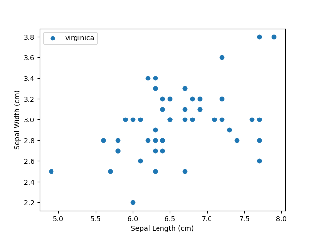

# 🌸 Iris Modeling Project


## 📖 About This Project

This project focuses on building and evaluating machine learning models for the classic Iris dataset. The Iris dataset is widely used for pattern recognition and classification tasks, containing measurements for three species of iris flowers: setosa, versicolor, and virginica.

The main objectives of this repository are:
- 🏷️ Data preprocessing and visualization
- 🛠️ Training supervised learning models (e.g., Logistic Regression, SVM, Decision Trees)
- 📊 Evaluating performance metrics (accuracy, confusion matrix, etc.)
- 🚀 Demonstrating how to use the trained models for prediction

## ⚙️ How It Works

1. **Data Preparation**  
   The Iris dataset is loaded and split into training and testing sets. Exploratory data analysis and visualization help understand the data distribution and key features.

2. **Model Training**  
   Multiple machine learning algorithms are applied to the training data. Hyperparameter tuning may be performed for optimal results.

3. **Evaluation**  
   Each model is assessed using metrics such as accuracy, precision, recall, and F1-score. Confusion matrices are used to visualize prediction results.

4. **Prediction**  
   The best-performing model(s) are used to make predictions on new, unseen data samples.

## 🚩 Getting Started

### Prerequisites

- Python 3.8 or higher
- Common ML libraries: `numpy`, `pandas`, `scikit-learn`, `matplotlib`, `seaborn`

### Installation

Clone the repository:
```bash
git clone https://github.com/Achintha-999/iris-modeling.git
cd iris-modeling
```
Install dependencies:
```bash
pip install -r requirements.txt
```

### Running the Project

Run the main script to train and evaluate models:
```bash
python main.py
```

## 📁 Project Structure

```
iris-modeling/
├── data/              # Dataset and data loading scripts
├── models/            # ML model scripts
├── notebooks/         # Jupyter notebooks for EDA and experiments
├── main.py            # Main program entry point
└── README.md          # Project documentation
```

## 🏆 Results

The repository provides results for several ML algorithms. You can compare models and use the best one for your own iris predictions!


## 🖼️ Generated Output

<div align="center">
  
</div>


## 🤝 Contributing

Contributions are welcome! Please fork the repo, create a branch, and open a pull request.

## 📄 License

This project is licensed under the MIT License.

---

Happy Modeling! 🌸
